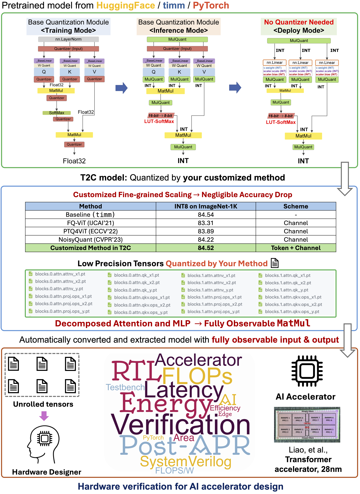

# Torch2Chip (MLSys, 2024)

Torch2Chip is an End-to-end Deep Neural Network compression toolkit designed for prototype accelerator designer for algorithm-hardware co-design with high-degree of algorithm customization.

**[[Documentation]](https://mengjian0502.github.io/t2c-doc/)**

## :rocket: News & Update

- **[04/15/2024]:** Initial version of Torch2Chip is published together with the camera-ready version of our **MLSys paper!** :fire:
- **[04/26/2024]:** SmoothQuant and QDrop are added to Torch2Chip!
- **[04/26/2024]:** INT8 Vision models and checkpoints are available for download!
  - Integer-only model with fully observable input, weight, output tensors. 
- **[04/26/2024]:** INT8 BERT model is ready with SST-2 dataset demo (Beta version). 
- **[07/18/2024]:** We apologize for the delay but the documentation and tutorials are finally online **[Link to the documentation](https://mengjian0502.github.io/t2c-doc/)**!. 

## :question: Why Torch2Chip?

The current "design-and-deploy" workflow faces under-explored challenges in the current hardware-algorithm co-design community due to some unavoidable flaws:

- **Deep Learning framework:** Although the state-of-the-art (SoTA) quantization algorithm can achieve ultra-low precision with negligible degradation of accuracy, the latest deep learning framework (e.g., PyTorch) can **only** support non-customizable 8-bit precision, data format (`torch.qint8`).

- **Algorithms:** Most of the current SoTA algorithm treats the quantized integer as an *intermediate result*, while the final output of the quantizer is the "discretized" floating-point values, ignoring the practical needs and adding additional workload to hardware designers for integer parameter extraction and layer fusion.

- **Industry standard Toolkit:** The compression toolkits designed by the industry (e.g., OpenVino) are constrained to their in-house product or a handful of algorithms. The limited degree of freedom in the current toolkit and the under-explored customization hinder the prototype ASIC-based accelerator.


From the perspectives of the hardware designers, the conflicts from the DL framework, SoTA algorithm, and current toolkits formulate the cumbersome and iterative designation workflow of chip prototyping, **which is what Torch2Chip aim to resolve.**

## :star: What is Torch2Chip?

Torch2Chip is a toolkit that enables **customized** model compression (e.g., quantization) with **full-stack observability** for customized hardware designers. Starting from the user-customized compression algorithms, Torch2Chip perfectly meet the bottom-level needs for the customized AI hardware designers: 

- **[Model and Modules]:** Unlike the open-sourced quantization algorithms, Torch2Chip **does not require** the user to have your customized moule or even model file (e.g., `resnet.py`). 

  

- **[Customize]:** User just need to implement their own algorithm by following the proposed "dual-path" design. Torch2Chip will take care of the reamining step.

  

- **[Decompose & Extract]:** Torch2Chip **decompose** the entire model down to the basic operations (e.g., `matmul`) , where the inputs are compressed by the **user-customized** algorithm.




## Pre-trained Checkpoint

The model checkpoint is packed with the extracted tensors out of the basic operations (e.g., `MatMul`, `Conv`). 

```bash
# Downloaded file
vit_small_lsq_adaround.tar.gz
|
--ptq
  |
  --[quantization method]
    |
    --checkpoint.pth.tar
    	|
    	--/t2c/
        |
        ----/tensors/
        ----t2c_model.pth.tar
```

The pre-trained checkpoint contains **both** model file and all the extracted tensors. 

- The folder `quantization method` is named by the selected activation and weight quantization method from user (e.g., `lsq_minmax_channel`) .

- `checkpoint.pth.tar` contains the model file that directly quantized via the PTQ method with **fake quantization**. 

- `/t2c/` folders contains 1) The integer-only model after conversion and 2) the extracted tensors out of the basic operations. 

  - `t2c` folder contains the intermediate input and output tensors of the basic operations with batch size = 1. 

    E.g., `blocks.0.attn.qk_x1.pt` is the low precision input (Query) of the `MatMul` operation between query and key. 

### Vision model on ImageNet-1K (INT8)

|            Model             |                        Pre-trained By                        |                      MinMax Channel+LSQ                      | AdaRound+LSQ                                                 | MinMaxChannel + Qdrop                                        | MinMaxChannel + LSQToken                                     | MinMaxChannel + MinMaxToken                                  | MinMaxChannel+QDropToken                                     |
| :--------------------------: | :----------------------------------------------------------: | :----------------------------------------------------------: | ------------------------------------------------------------ | ------------------------------------------------------------ | ------------------------------------------------------------ | ------------------------------------------------------------ | ------------------------------------------------------------ |
|          ResNet-50           |                         torchvision                          | 76.16 ([link](https://cornell.box.com/s/m5lf1zvhu0wq1yn42xa8r5vk2a8vg67q)) | 76.12 ([link](https://cornell.box.com/s/r8qzy84r0wi0ljzwh02gaiayhzy3ro7t)) | 76.18 ([link](https://cornell.box.com/s/zeiwt0xaodsokhlcpt1laus4pnlddr3p)) | N/A                                                          | N/A                                                          | N/A                                                          |
|          ResNet-34           |                         torchvision                          | 73.39 ([link](https://cornell.box.com/s/drfl6h81um8hz5kve4uh0224tfcastis)) | 73.38 ([link](https://cornell.box.com/s/28zm2ooqmq0u8r5kzhe2tk8ts15iq6ij)) | 73.43 ([link](https://cornell.box.com/s/h2ozvg01v91pb2yrm0dj8hplqge0p6vh)) | N/A                                                          | N/A                                                          | N/A                                                          |
|          ResNet-18           |                         torchvision                          | 69.84 ([link](https://cornell.box.com/s/f6b96v5ntnnl01bi4sc9x54384lc85eo)) | 69.80 ([link](https://cornell.box.com/s/vv3tpwnrgwt3o568rg1i4sfh7d2nummy)) | 69.76 ([link](https://cornell.box.com/s/0thjpsg1now1y12vpv7hns6gm5gwblv7)) | N/A                                                          | N/A                                                          | N/A                                                          |
|           VGG16-BN           |                         torchvision                          | 73.38 ([link](https://cornell.box.com/s/xk3exwazlqkbwggr0aic9101njxgh9he)) | 73.40 ([link](https://cornell.box.com/s/nnizogf2w4363zuwd6qdj67ivq5d4uqs)) | 73.39 ([link](https://cornell.box.com/s/j9mf3fiho1nwdfdwrp9tzcewcwbbqqh0)) | N/A                                                          | N/A                                                          | N/A                                                          |
|         MobileNet-V1         | t2c ([link](https://cornell.box.com/s/1pj175aat8u485st53wtou860ytl1317)) | 71.21 ([link](https://cornell.box.com/s/y39dctts5mcy3nvg7ijku38m3qu9jo0r)) | 69.87 ([link](https://cornell.box.com/s/tihfrf7ycbc60ztmah4vvol25utnzyr5)) | 71.13 ([link](https://cornell.box.com/s/2kofjc5fpo3ee5ao007d5xaq2lt7c4d4)) | N/A                                                          | N/A                                                          | N/A                                                          |
|     vit_tiny_patch16_224     |                             timm                             | 72.79 ([link](https://cornell.box.com/s/sw527tqwpb93npn1cwj28evjhtglw8dh)) | 72.65 ([link](https://cornell.box.com/s/6iv44h09gvtl0x063cgddw1m5638ye3j)) | 72.41 ([link]())                                             | 72.49 ([link](https://cornell.box.com/s/a9qmwual9zij4wwlzxnds438ma7o7j5n)) | 73.27 ([link](https://cornell.box.com/s/hy2i35sxldv6w9jq8unj34c9eayt9fzb)) | 73.00 ([link](https://cornell.box.com/s/1lzdst3xg9dtii8ke5x9u2rkoildwwds)) |
|    vit_small_patch16_224     |                             timm                             | 81.05 ([link](https://cornell.box.com/s/jp4rm1n5b6nw18fp7klq8wae8przd1km)) | 81.02 ([link](https://cornell.box.com/s/q2ermpeps3jc2xng9u06xeb39t4dcej7)) | 80.89 ([link]())                                             | 80.21 ([link](https://cornell.box.com/s/9eaput327il2en2syc5c7p6pao04tgag)) | 80.04 ([link](https://cornell.box.com/s/b0dhbfix3poqanr1h3oa4h5j4z34foii)) | 80.22 ([link](https://cornell.box.com/s/4cv2l2rbzu8b1yvuo2cir45hyrk1x87u)) |
|     vit_base_patch16_224     |                             timm                             | 84.87 ([link](https://cornell.box.com/s/l3pm0pcrv5vei5grzp91a6ykh5c1d58e)) | 84.62 ([link](https://cornell.box.com/s/w63iwze4rap1m9imd40qhtppefbgpi3n))                                                 | 84.50 (link)                                                 | 84.68 ([link](https://cornell.box.com/s/tgoq5myeyv4dffukoibr2sn8aot06dni)) | 83.86 ([link](https://cornell.box.com/s/8ogly9raj4lehuy08aqkcndupgavw98k)) | 84.53 ([link](https://cornell.box.com/s/sofljzpg5j9kbda0o4iow8nq0g658mg8)) |
| swin_tiny_patch4_window7_224 |                             timm                             |                         80.83 ([link](https://cornell.box.com/s/q2w8asg1f5m9ly91goy1metm7ht4brzb))                         | 80.76 ([link](https://cornell.box.com/s/xrgc58t2hw7pgaavj5oc83tek9l7fof2))                                                 | 80.71 (link)                                                 | 80.30 ([link](https://cornell.box.com/s/p2lzdv8jhplm2a98b50aj7vfi50g2tjm))                                                 | 80.74 ([link](https://cornell.box.com/s/cw2yf6in70qff79ew1ydjuuvjm703afs))                                                | 80.10 ([link](https://cornell.box.com/s/7vl82guedt9hlu3d25fdojtclqsg2ht3))                                                 |
| swin_base_patch4_window7_224 |                             timm                             |                         84.73 (link)                         | 84.62 (link)                                                 | 84.65 (link)                                                 | 84.27 (link)                                                 | 84.58 (link)                                                 | 84.32 (link)                                                 |
|        BERT-Base-SST2        |                         HuggingFace                          |                                                              |                                                              |                                                              |                                                              | 0.922 (link)                                                 |                                                              |

### Vision model on ImageNet-1K (INT4)

**[Coming soon!]**

## :notes: Authors

Members of [Seo Lab](https://seo.ece.cornell.edu/) @ Cornell University led by Professor Jae-sun Seo.

[Jian Meng](https://mengjian0502.github.io/), Yuan Liao, Anupreetham, Ahmed Hasssan, Shixing Yu, Han-sok Suh, Xiaofeng Hu, and Jae-sun Seo.

## :package: Cite Us
**Publication:** *Torch2Chip: An End-to-end Customizable Deep Neural Network Compression and Deployment Toolkit for Prototype Hardware Accelerator Design* (Meng et al., MLSys, 2024).

### Acknowledgement

This work was supported in part by Samsung Electronics and the Center for the Co-Design of Cognitive Systems (CoCoSys) in JUMP 2.0, a Semiconductor Research Corporation (SRC) Program sponsored by the Defense Advanced Research Projects Agency (DARPA).

